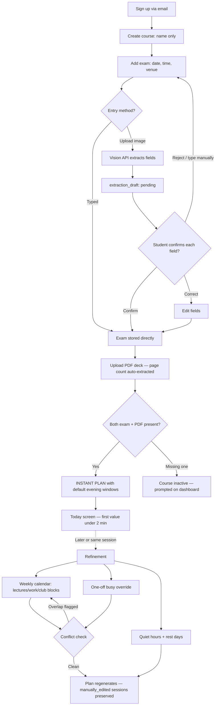
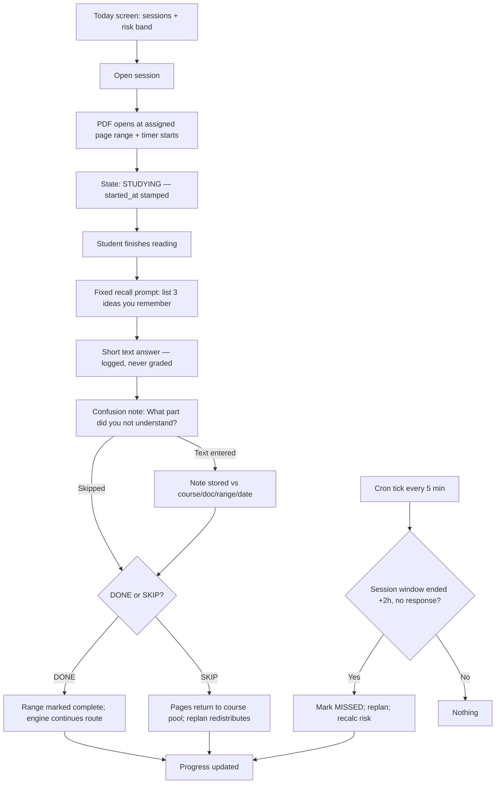
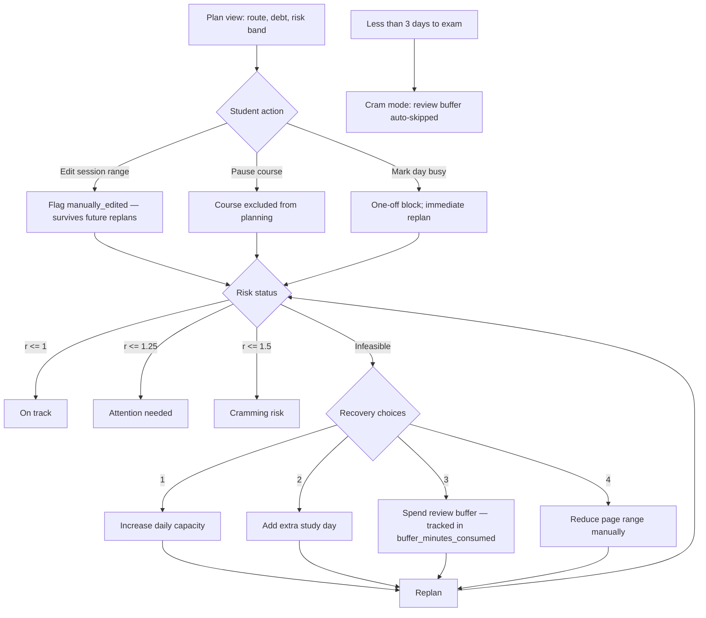
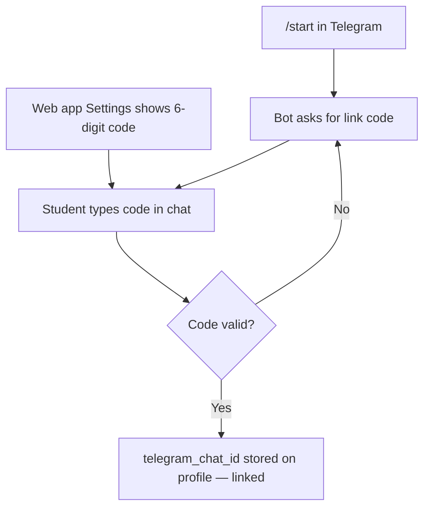
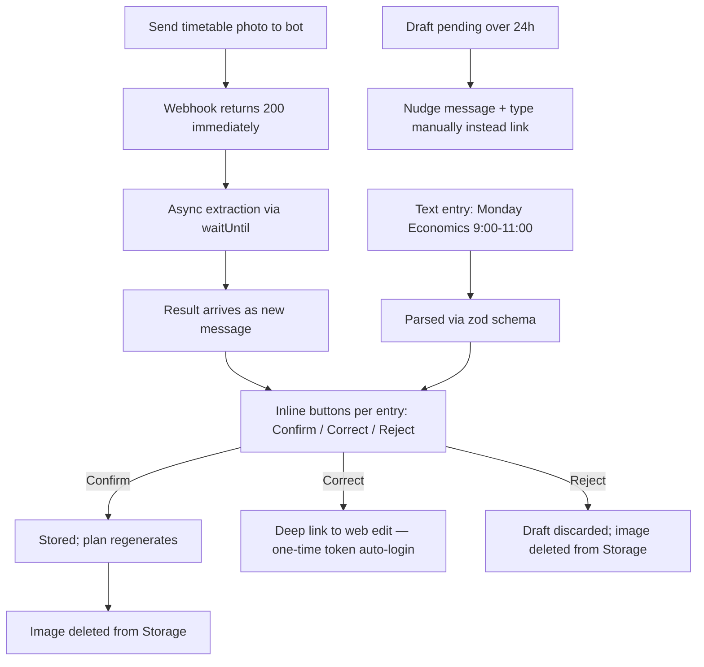
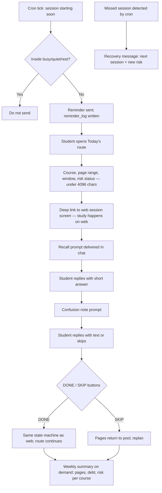
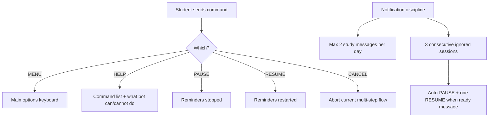
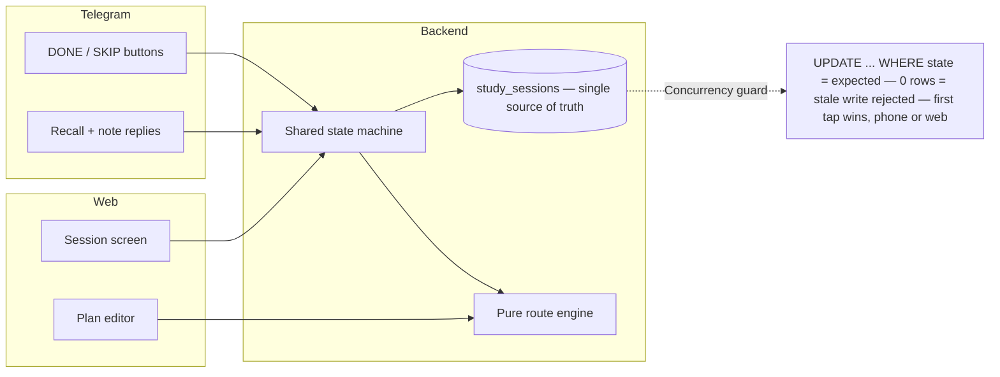

# Project B — User Flow Diagrams

Companion to: `Project B — Technical Overview Plan.md` (user flows in diagram form).
Mermaid syntax — renders on GitHub, Notion, VS Code (with Mermaid extension).

> v2: page count removed from course creation — it comes from PDF upload only. No PDF yet = course inactive. All node labels quoted for parser compatibility.

---

## 1. Web app — first-time setup (quick-plan path)

## 2. Web app — daily study loop

## 3. Web app — plan management and repair

## 4. Telegram — one-time account linking

## 5. Telegram — timetable capture

## 6. Telegram — daily loop

## 7. Telegram — utility commands and notification discipline

## 8. Shared state — both interfaces, one backend

## 9. Responsibility split (which interface does what)

| Action | Web | Telegram |
| --- | --- | --- |
| Account creation | Yes | No (link only) |
| Course creation (name only) | Yes | No |
| Exam entry | Yes (typed or image) | Image or text |
| PDF upload — supplies page count | Yes | No |
| Weekly availability editing | Yes | Text entry + image only |
| Studying (PDF view + timer) | Yes | No — deep link to web |
| Today's route + risk | Yes | Yes |
| DONE / SKIP | Yes | Yes |
| Recall prompt + confusion note | Yes | Yes |
| Plan editing / manual range adjust | Yes | No — deep link |
| Recovery-choice selection | Yes | Notification + deep link |
| Progress / analytics | Yes | Compact weekly summary only |
| PAUSE / RESUME reminders | Settings | Commands |
