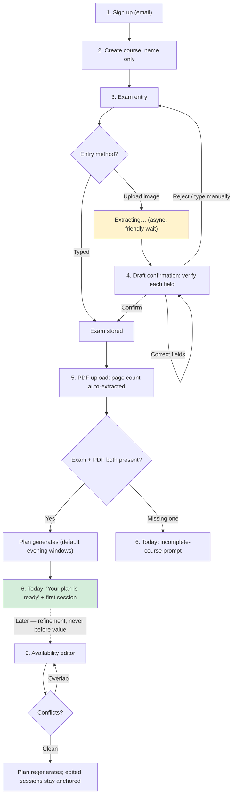
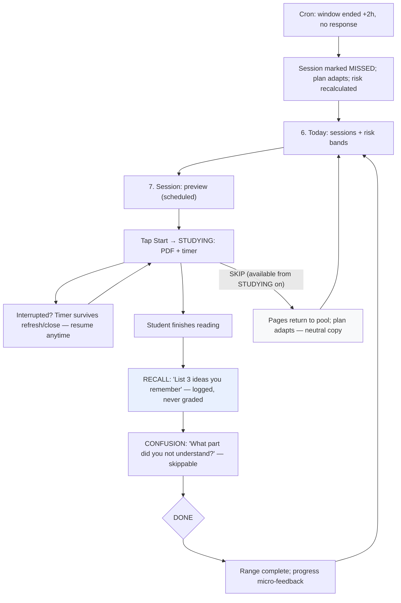
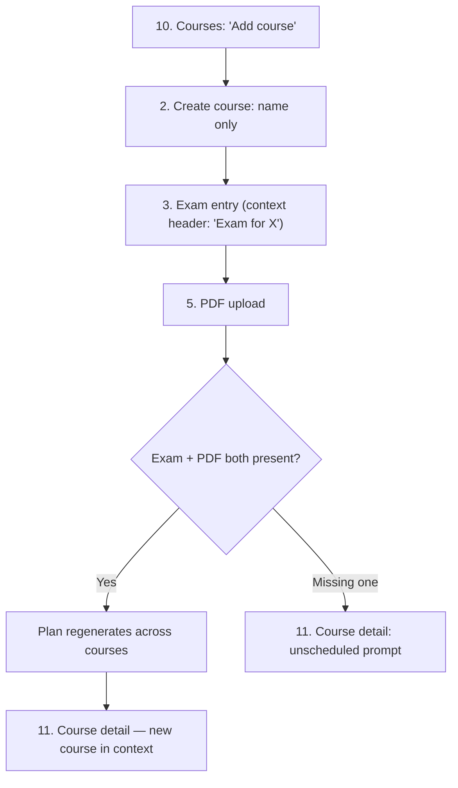
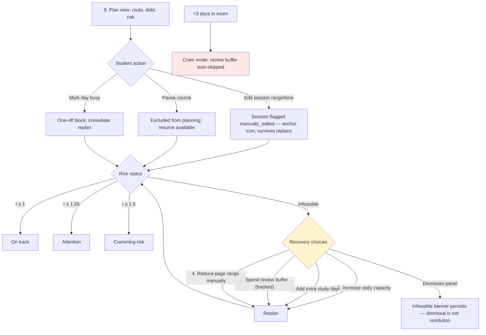
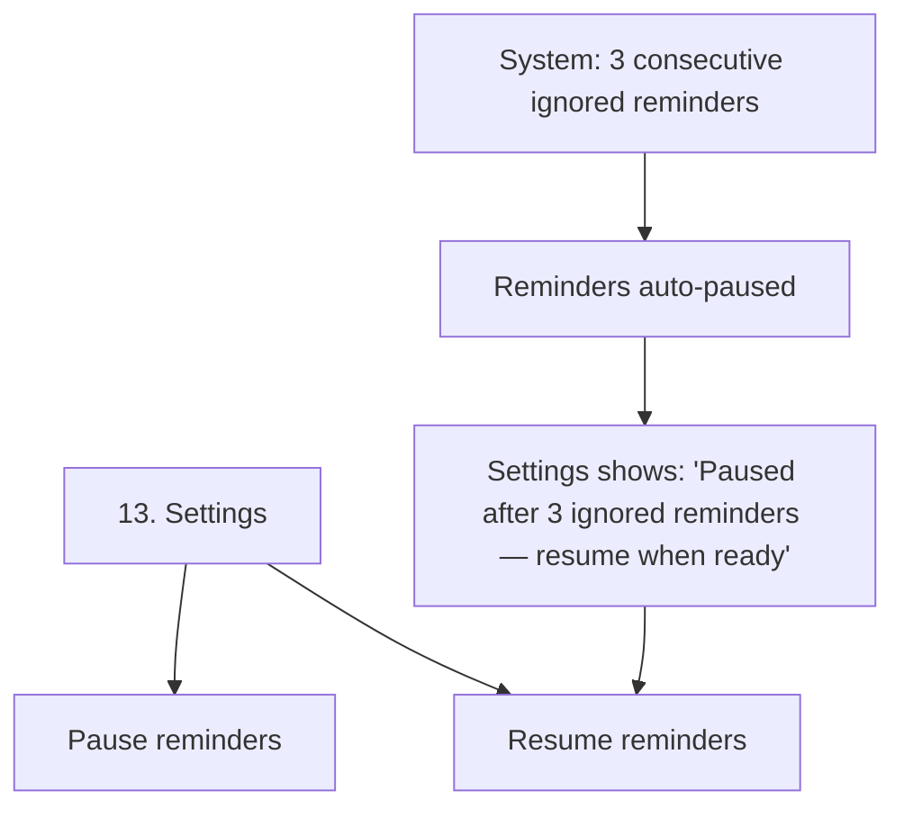

# 02 — User Journeys

How users move through screens across states. Each journey has a Mermaid diagram (renders on GitHub/Notion/VS Code), a state narrative, and design annotations (emotion, friction, drop-off risk).

Screen names match `01-screen-specs.md`.

---

## Journey 1 — Quick-plan onboarding (the 2-minute promise)

**Goal:** Signup → first personalized plan in under 2 minutes. This is the product's handshake; every screen here carries drop-off weight.

**State narrative:**
The student is skeptical and impatient — they've tried planners before. Every field must justify itself. The typed exam path is 4 fields; the image path trades typing for verification (draft confirmation). The PDF upload is the moment the plan becomes *real* — the page count appearing automatically is a small delight; play it up. When the plan generates, celebrate briefly, then point at the first session. Do **not** ask about availability, quiet hours, or study preferences here — defaults carry the student to value; refinement waits.

**Design annotations:**
- ⚡ **Highest drop-off risk:** screens 1–3. Ruthlessly minimize.
- 😟 **Anxiety moment:** exam date entry — it makes the deadline real. Keep tone calm.
- ⏳ **Wait moment:** extraction. Seconds of async work — use a friendly progress state ("Reading your timetable…"), never a bare spinner.
- 🎉 **Payoff moment:** plan generated. This is the screenshot in the demo.
- 🚪 **Escape hatch:** "type manually instead" visible at every extraction step.

---

## Journey 2 — Daily study loop (the core habit)

**Goal:** Open app → study → recall → note → respond. Repeat daily. This loop *is* the product.

**State narrative:**
The student arrives in one of three moods: ready (tap Start), guilty (returning after a miss), or resistant (considering SKIP). The design must serve all three without judgment. Starting is an explicit tap — never auto-start the timer on page open. The recall prompt is fixed and short — it's a reflection ritual, not a quiz; **no scoring UI, no red/green on the answer**. The confusion note is skippable because friction here kills completion. SKIP is available from STUDYING onward — a student who can't study right now isn't forced through recall to bail (recall is required only for DONE). DONE gives a small reward (progress tick). SKIP is *not* a failure state — the plan absorbs it; copy should feel like the system has their back ("No problem — these pages are rescheduled"). A missed session triggers silent adaptation; next visit shows the updated plan with a gentle notice, never an alarm.

**Design annotations:**
- 🧘 **Focus mode:** the session screen is a study room — minimize chrome, notifications, navigation temptation.
- 😰 **Guilt risk:** missed/debt states. Tone: forward-looking ("here's your updated plan") not backward ("you failed to…").
- ⚖️ **DONE/SKIP balance:** neither button visually punished. DONE can be more prominent (it's the goal) but SKIP must not be hidden or shame-styled.
- 🔌 **Interruption resilience:** timer survives refresh/close (derived from `started_at`). A student actively in the session is never marked missed — the +2h rule applies to *no response*, not study duration.
- 📱 **Mobile-friendly:** PDF reading and the recall/note flow must work well on phones — plenty of students will study from one.

---

## Journey 1b — Adding a second course (returning user)

**Goal:** Same quick-plan mechanics, different emotional frame — no celebration needed, land where management happens.

**State narrative:**
Returning users know the drill — skip the celebration, skip the "Your plan is ready" moment (that's Today-first-visit only). Landing on Course detail after creation shows the new course in context and confirms the cross-course replan. The exam-entry and PDF-upload screens are identical to onboarding; only the entry point, context headers, and landing differ.

---

## Journey 3 — Plan repair and recovery (when life happens)

**Goal:** Student adapts the plan to reality — edits, busy days, pauses — and recovers when the math says infeasible.

**State narrative:**
The student here is either in control (fine-tuning) or stressed (infeasible). For fine-tuning: make the anchor behavior explicit — when they edit a session, tell them it won't move in future replans; ambiguity here destroys trust. For infeasible: **never silent overload.** The four recovery choices are honest trade-offs; present them as options with consequences ("spending buffer leaves less review time"), not as errors. Buffer spending is the most interesting: it's a budget, visualize it like one — remaining buffer after the spend, not just a recolor.

**Design annotations:**
- 😰 **Peak anxiety:** infeasible state. Calm colors, structured choices, zero blame. Copy fixed: "X pages/day needed — pick what to drop."
- ⚓ **Trust element:** manually-edited anchors must be visually identifiable wherever sessions appear.
- 💰 **Buffer as budget:** 20% total − consumed. A depleting resource reads instantly; a percentage alone doesn't.
- 🔥 **Cram mode:** urgency without panic. Buffer auto-skip is explained ("review time converted to first-pass study").
- 🚪 **No forced choice:** the student can dismiss the recovery panel — the infeasible banner stays (calmly) until resolved. Dismissal is not resolution.

---

## Journey 4 — Notification & reminder settings (design surface only)

The reminder system itself is backend/bot territory, but its **controls and status** live in web Settings, and its rules shape UX trust:

**Design annotations:**
- 🔕 Notification discipline (quiet hours respected, message caps, auto-pause) is a *trust feature*. The Settings copy should make the restraint visible — students trust systems that explain it.
- 📉 The auto-paused state is the key variant: warm, zero guilt, one-tap resume. Note: "ignored" ≠ "missed" — MISSED is a session state (window +2h, no response); ignored means the reminder itself went unanswered. A student can ignore reminders while still studying via web.

---

## Journey 5 — Shared state across devices (concurrent use)

A session can be started on one device and responded to on another. The backend guarantees first-write-wins; the design rule:

**Any surface that can respond to a session must handle the "already responded" state gracefully.** The student should never know a concurrency guard exists — only that the app always shows the truth. No error framing, no dead buttons without explanation.

---

*Screen details → `01-screen-specs.md`. Full state checklist → `03-state-matrix.md`. Note: the plan includes Telegram capture/reminder flows — those chat legs are out of design scope; web screens they touch (draft confirmation, Settings) are covered above.*
