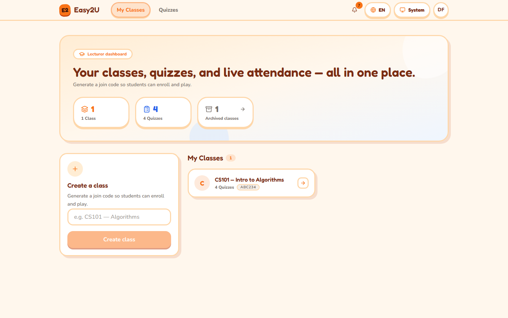
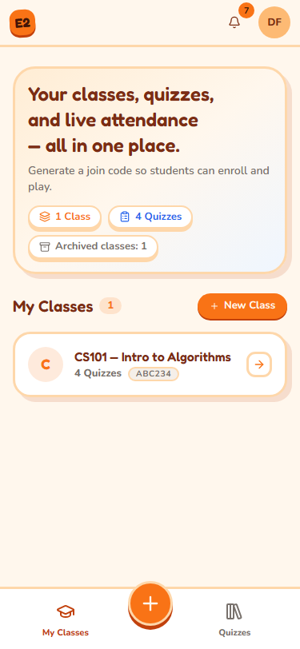
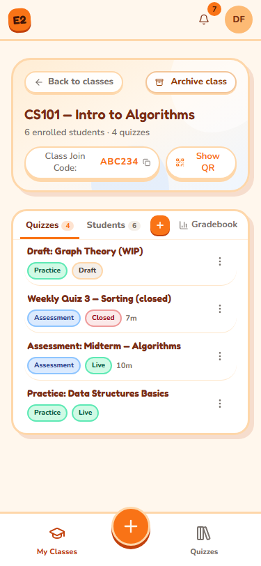
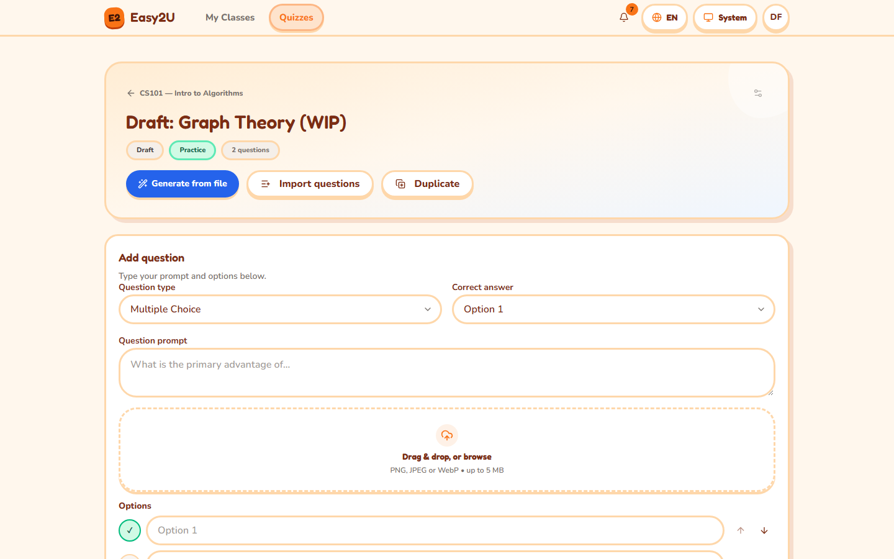
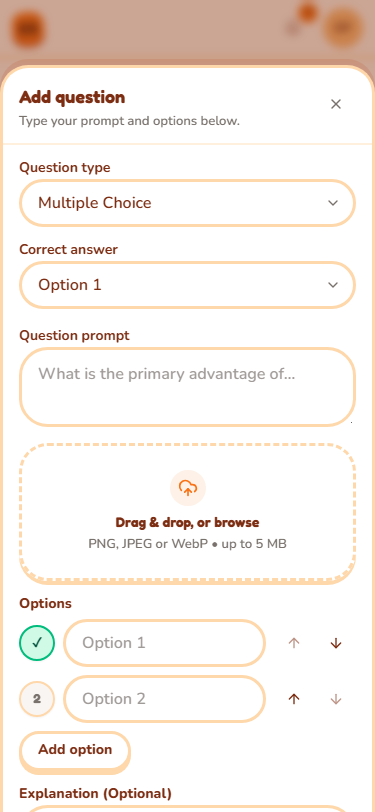
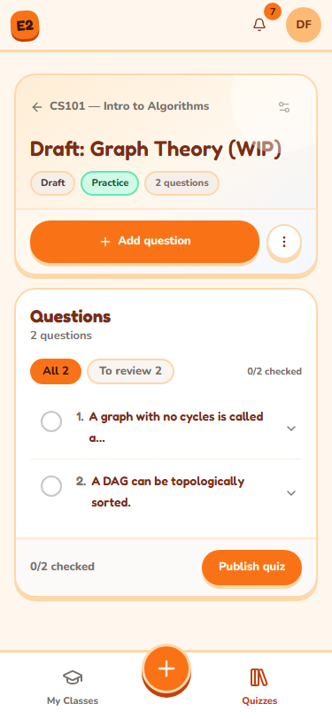
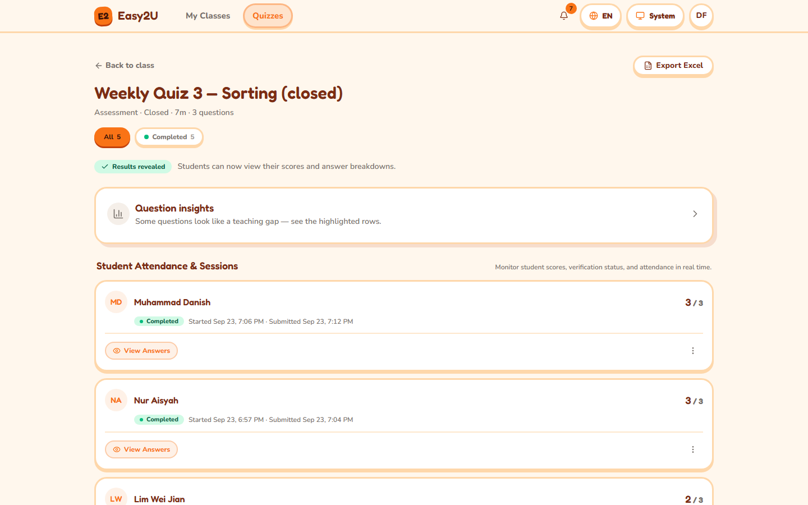
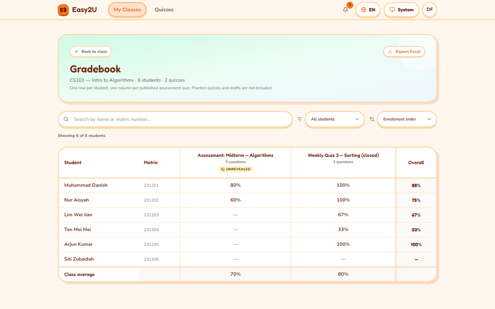
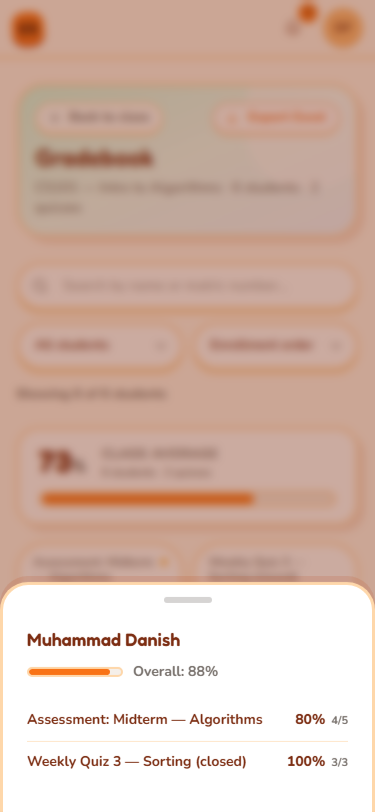

# Lecturer guide

> **English internal edition.** See the [manual home](README.md) for the quick
> start and [Troubleshooting](troubleshooting.md) for common problems.

This guide covers classes, quiz authoring, assessment monitoring, results, and
reports. An institution may disable AI generation or web search. Those options
appear here only when they are available in your account.

## Sign in as a lecturer

**You need:** a lecturer account, or a lecturer invite code supplied by your
institution. A student account does not gain lecturer access by changing its
profile.

1. On **Sign in**, enter your **Email address** and **Password**, then select
   **Sign in**. If your institution offers it, you can select **Sign in with
   Microsoft** instead.
2. To make a new lecturer account, select **Create one now**, enter your name,
   email and password, select **Lecturer** under **I am a…**, and enter the
   **Lecturer invite code** supplied by your administrator.
3. Select **Create account**. If the app asks you to confirm your email, open
   the confirmation message before signing in.

**What happens next:** you reach your lecturer dashboard, starting at **My
Classes**. If you are sent to the student area, [get help](support.md) with
your role or invite code.

**If it does not work:** select **Forgot password?** on the sign-in page, or
use [sign-in troubleshooting](troubleshooting.md#account-and-sign-in).

## Find your way around

**Desktop:** use **My Classes** and **Quizzes** in the top navigation. The
notification bell and account menu are in the header.

**Phone:** use the bottom dock for classes and quizzes. On **My Classes**, use
**New Class** to create a class; the center **Create** control opens choices
for a new class or quiz. Open the account sheet for
language, theme and sign-out options. The dock can hide while the on-screen
keyboard is open; close the keyboard to see it again.

<figure class="manual-shot" data-device="desktop"><figcaption><strong>Desktop:</strong> use the top navigation. The Create a class form is on My Classes. Select the image to enlarge it.</figcaption></figure>

<figure class="manual-shot" data-device="phone"><figcaption><strong>Phone:</strong> use New Class on this page or the center Create control in the bottom dock. Select the image to enlarge it.</figcaption></figure>

The **Quizzes** library shows quizzes from all of your classes, including
quizzes in archived classes. Search by title there. Open a draft in the
builder or select **Results** for a published quiz.

## Create a class and invite students

**You need:** a lecturer account. A class gets its own six-character join
code when you create it.

1. Open **My Classes**.
2. **Desktop:** in **Create a class**, enter a **Class title** and select
   **Create class**. **Phone:** select **Create** > **New class**, enter the
   title in the sheet, and select **Create class**.
3. Open the new class card. Find its **Class Join Code**.
4. Select **Copy join code** to send the code through your usual course
   channel. For students in the room, select **Show QR** and let them scan
   it. A student who is signed out is sent through sign-in and then returns
   to the join confirmation.
5. Ask students to confirm the class name and join. Open the class **Students**
   tab or roster section to check enrollment.

<figure class="manual-shot" data-device="phone"><figcaption><strong>Phone class detail:</strong> the sample code illustrates where to find yours. Use Show QR for students in the room; switch to Students to inspect the roster. Select the image to enlarge it.</figcaption></figure>

**What happens next:** the class is listed under **My Classes** and you can
create quizzes in it. Do not send the code to someone who should not join.

**If it does not work:** check the class title and connection, then see
[class and join troubleshooting](troubleshooting.md#classes-and-join-codes).

### Review the class roster

1. Open **My Classes**, then open the class.
2. **Desktop:** find the **Students** section or tab. **Phone:** select the
   **Students** tab to switch from class quizzes to the roster.
3. Check the student names and matric numbers shown there. For a large class,
   a notice may say only the first 100 students are listed; other enrolled
   students still count toward quizzes and exports.

For a student who cannot join, confirm you shared this class's current code
and that the class is active. The [student join guide](student.md#join-a-class)
can be sent to them.

### Archive or restore a class

Archiving hides a class from students and stops new joins while preserving
quizzes, results and audit history. Restoring makes its live quizzes available
again. Confirm with your institution before archiving a class still in use.

1. Open the class from **My Classes** and select **Archive class**.
2. Read **Archive this class?**, then select **Archive class** to confirm.
3. To restore it, open **Archived classes**, find the class, select
   **Restore**, and confirm **Restore class**.

**What happens next:** the restored class returns to **My Classes**. If it had
live quizzes, check their schedule and availability before telling students to
resume.

## Create a quiz

**You need:** an active class. Decide whether students need repeat practice
with immediate feedback or a controlled assessment.

1. Open **My Classes** and choose the class. Select **New Quiz** or find
   **Create a new quiz**. From the **Quizzes** library, you can also start
   **New quiz** and choose a destination class.
2. Enter the **Quiz title** and choose **Quiz mode**:
   **Practice** permits repeat attempts and immediate feedback;
   **Assessment** uses controlled attempts and may require face verification.
3. For an assessment, set **Time limit** if needed. Leave **No time limit**
   when there is no countdown.
4. Optionally set **Opens at** and **Closes at**. The form labels these times
   in Malaysia time. The closing time must follow the opening time.
5. If appropriate, turn on **Allow retakes** and choose **Max attempts**.
   Review **Shuffle question & option order** and **Hand gestures** before
   publishing; those draft settings cannot be changed once the quiz is live.
6. Select **Create quiz** to open its draft builder.

**What happens next:** the quiz is a **draft**, hidden from students until you
publish it. A live quiz can still be unavailable before its opening time or
after its closing time. See [quiz states](glossary.md).

**If it does not work:** verify the class is active and that the closing time
follows the opening time. See [quiz troubleshooting](troubleshooting.md#quiz-creation-and-publishing).

### Add and edit questions

1. Open the draft quiz's builder and find **Add question**.
   **Phone:** use the builder's add-question control to open its sheet.
2. Select **Question type**: **Multiple choice**, **True / False**,
   **Multiple select**, or **Short answer (AI-marked)**.
3. Enter the **Question prompt**. For option-based questions, enter distinct
   options and mark the **Correct answer** or **Correct answers**. For a short
   answer, provide a clear **Answer key / rubric** for the marker.
4. Add an optional explanation or question image, then select
   **Add this question**. Review the new item in **Questions**.
5. Use **Edit**, **Move up**, **Move down**, or **Delete** on a draft question
   as needed. **Phone:** expand the compact question controls if the actions
   are not visible immediately.

<figure class="manual-shot" data-device="desktop"><figcaption><strong>Desktop builder:</strong> choose the question type and correct answer, then enter the prompt and options. Select the image to enlarge it.</figcaption></figure>

<figure class="manual-shot" data-device="phone"><figcaption><strong>Phone builder:</strong> Add question opens a sheet with the same fields. Scroll within the sheet to finish the form. Select the image to enlarge it.</figcaption></figure>

The builder accepts at most 30 questions in a quiz. Multiple-choice options
are limited, and multiple-select has a smaller option cap. Follow the form's
validation message if it rejects a question. Hand gestures may be unavailable
for some question types or when **Hand gestures** is off; students can use
the offered keyboard or tap controls.

**What happens next:** the draft remains editable. Before publishing, check
each answer key and explanation. Deleting a question also removes its image
and cannot be undone.

### Import several questions

1. In a draft builder, select **Import questions**.
2. Paste a pipe-separated **Question list**, or select **Upload file** for a
   `.txt` or `.csv` text file.
3. Follow the example in the dialog to mark the correct answer with `*`.
   Check **Preview** and correct every line-level warning.
4. Select **Import questions** when the preview shows the intended items.

Import adds to the existing draft. It does not replace it. The dialog shows
the remaining slots up to the 30-question limit. If you need to change an
imported item, use **Edit** in the builder.

### Generate questions with AI, when available

AI output is a draft. You are responsible for checking wording, answer keys,
images and suitability for your class before publication.

1. In a draft builder, select **Generate from file**. Choose **Upload
   Documents** for supported files or **Paste Notes** for text. The dialog
   accepts PDF, DOCX, PPTX, TXT, MD and supported image files; it shows the
   current per-file and total limits.
2. For an image or scanned PDF, choose the available **Document Scanner**.
   Select **Read Files & Continue** or **Continue with Text** and inspect the
   extracted content. If pages were missed, correct that before generating.
3. Choose the number of questions, difficulty, format and quiz language. Use
   **Custom AI Focus & Directives** for topic guidance. If offered, **Add
   up-to-date web knowledge** searches for extra material in addition to your
   upload or notes.
4. Choose **Add to existing questions** or **Replace all existing questions**.
   Replacing removes the current draft questions. Confirm that choice before
   selecting **Generate quiz**.
5. Wait for **Generation complete**, then select **Review questions**.
   Correct mistakes in the builder; use **Regenerate with AI** on an
   individual question only when needed.

**What happens next:** questions are saved to the draft, not automatically
published. The builder may mark generated questions **To review**; use that
filter and **Mark checked** as you verify them.

**If it does not work:** use the dialog's retry or scanner choice, try a
smaller or clearer source, or add questions manually. See
[AI and import troubleshooting](troubleshooting.md#ai-import-and-export).

### Duplicate a quiz

1. Open the quiz builder and select **Duplicate**. The action may be under
   **More actions** on a narrow screen.
2. Choose an active **Destination class** and select **Duplicate**.
3. Select **Open draft** to review the new copy before publishing it.

The copy includes questions, settings and images, but does not copy student
attempts or results. The destination cannot be an archived class.

## Publish and manage a quiz

Only a draft with at least one question can be published. Publishing makes it
live, but an opening time can still prevent students from starting yet.

1. In the draft builder, review every question and its answer key. Check
   **Quiz settings**, including mode, time limit, schedule, retakes,
   shuffling and hand gestures.
2. Select **Publish quiz** and wait for the **Live** status.
3. Open **Results** to monitor attempts. If you set an availability window,
   check its **Opens at** and **Closes at** values before sharing the quiz.

<figure class="manual-shot" data-device="phone"><figcaption><strong>Phone publishing:</strong> check the question list, then use Publish quiz at the bottom of the builder. Select the image to enlarge it.</figcaption></figure>

**What happens next:** enrolled students can see the live quiz. They can
start only while it is open and they have an available attempt.

### Change a live quiz's availability

Some live settings, including the availability window and retakes, can be
managed after publication. Question text, answer keys, shuffling and the
gesture setting are draft-only. Use **Edit settings** or the schedule control
where the quiz shows it, save the permitted changes, and confirm what the
student quiz card now says.

### Close a quiz

Closing is one-way. Students cannot start new attempts or answer more
questions; a student already taking it can still submit recorded work. You
may have to decide whether to reveal existing results as part of closing.

1. Open the live quiz's builder or **Results** and select **Close quiz**.
2. Read **Close this quiz?**, including any warning about submitted students
whose results remain hidden.
3. Choose **Reveal first, then close** if it is offered and you want students
to see their results, or choose **Close anyway** to leave results hidden.

**What happens next:** the status becomes **Closed**. You cannot return it to
Live. Check [Release results](#release-and-analyze-results) if students are
waiting for scores.

## Review attempts and help students

Open the class quiz and select **Results**. The **Quiz Results & Integrity**
page groups sessions as **Completed**, **Flagged**, **Abandoned**, or **In
progress**. Select a student's row to inspect their session, answer breakdown,
and **Integrity timeline**. An event is a signal to review in context; it is
not by itself a final judgment about a student.

**Desktop:** use the results table and row actions. **Phone:** use the compact
status filters and open the student's detail or **Session actions** menu.

<figure class="manual-shot" data-device="desktop"><figcaption><strong>Results:</strong> filter sessions, open a student's answers, and use Question insights for patterns across the class. Select the image to enlarge it.</figcaption></figure>

### Review a pending face enrollment

A panel on **My Classes** can list students whose face enrollment needs a
decision. Until reviewed, they cannot start a verified assessment.

1. Open **My Classes** and find the **face enrollments need review** panel.
2. Check the student and class using your institution's normal identity
process. Select **Approve** if the enrollment is correct, or **Reject — ask
   to re-enroll** if the student must capture again.
3. Tell the student the outcome through the usual class channel.

If you cannot establish the student's identity, contact your institution's
administrator before approving.

### Unlock, exempt, or reset an attempt

These are different actions. Choose the least disruptive one that addresses
the student's situation.

| Action | Effect |
| --- | --- |
| **Unlock** | Lets a flagged student continue after your review. |
| **Face-exempt** | Stops face checks for this one attempt. You must record a reason. |
| **Reset** | Permanently deletes this attempt's answers, progress and integrity details. It permits the student to start again and cannot be undone. |

1. On **Results**, find the student's session and read the status and
   **Integrity timeline**.
2. Open **Session actions** if the buttons are in a menu. Select **Unlock**,
   **Face-exempt**, or **Reset** as appropriate.
3. For **Face-exempt**, enter the required **Reason**. For **Reset**, read
   the confirmation carefully before completing it.
4. Refresh your view of the student's session, then tell the student what to
   do next. Do not tell them to start a second attempt unless the resulting
   status allows it.

**If it does not work:** see [attempt troubleshooting](troubleshooting.md#assessment-attempts-and-face-checks)
or [get more help](support.md).

### Review and adjust a short-answer mark

AI-marked short answers may show **Pending**, **Needs review**, or
**Marking failed**. Inspect the student's answer and rubric before releasing
results.

1. Open **Results**, select the student's session, and locate the short-answer
   question.
2. Compare the response, **Rubric**, and any **AI rationale**. Select
   **Adjust mark** when a correction is needed.
3. Choose the permitted **New mark**, enter a **Reason**, and save.

If results were already released, follow the page's prompt to republish the
corrected mark so students see the change.

## Release and analyze results

Assessment scores can be visible to lecturers before students see them.
Students see a score and answer review only after the results are released.
Practice quizzes give more immediate feedback. Some assessments can be set to
release automatically once the completion conditions are met.

### Reveal assessment results

1. Open the assessment's **Results** page and check completed attempts and
   any **Pending** or **Needs review** marks.
2. Read the **Results are hidden** panel. Select **Reveal to students** when
   the results are ready, then confirm.
3. Check that the page says **Results revealed**. Students can then open
   their scores and answer breakdowns.

Revealing is a one-way release. If you later correct a short-answer mark,
follow the republish instruction on the student's session detail.

### Inspect question insights

On **Results**, open **Question insights**. Compare the per-question correct
rate and option choices to find questions students struggled with. A
highlight such as **Only …% correct** is a prompt to review the teaching or
question wording, not a diagnosis on its own. The page will warn you if its
analysis was truncated for a very large class.

### Open and export the gradebook

1. Open **My Classes**, choose the class, and select **Gradebook**.
2. **Desktop:** scan the student-by-assessment table, then search, filter, or
   sort. **Phone:** scan the student list; select a student or quiz to open its
   bottom sheet. Only published assessments appear in the gradebook.
3. Select **Export Excel** to download the class workbook. Keep it in an
   institution-approved location because it contains student information.

<figure class="manual-shot" data-device="desktop"><figcaption><strong>Desktop gradebook:</strong> compare assessment columns and student rows; Export Excel is above the table. Select the image to enlarge it.</figcaption></figure>

<figure class="manual-shot" data-device="phone"><figcaption><strong>Phone gradebook:</strong> select a student in the list to open their assessment breakdown. Select the image to enlarge it.</figcaption></figure>

For one quiz, select **Export Excel** on that quiz's **Results** page. The
quiz export and class gradebook export are different reports. An
**unrevealed** marker means the lecturer can see the score while students
cannot yet see it.

**If it does not work:** review filters, the roster and quiz status, then see
[export troubleshooting](troubleshooting.md#ai-import-and-export).

## Notifications and account

Use the notification bell for updates such as a student attempt, flagged
session, or enrollment needing review. Open a notice to reach its relevant
class or quiz. In the account menu, switch **Language** or **Theme**, or
select **Sign out**. On a phone, these settings appear in the account sheet.

For a missing control, a code that does not work, or a failed export, start
with [Troubleshooting](troubleshooting.md). If the issue persists, use
[Get more help](support.md).
