# Student guide

Use this guide for class assessments and personal practice. A **class quiz** is assigned by a lecturer and may be a practice quiz or an assessment. A **personal quiz** is yours to create and practice; it is not class work and does not produce a class grade. A class quiz marked **Live** is available subject to its schedule and attempt rules. **Draft** quizzes are not available to students; **Closed** quizzes cannot be started.

## Create an account or sign in

**Where to go:** Open your institution's Easy2U address and choose **Create account** or **Sign in**. You need internet access and an email address. Use an institutional Microsoft account only if that option is offered by your institution.

### Create a student account

1. Open **Create account**.
2. Enter your **Full name**, **Email address**, and **Password**. The form requires a password of at least six characters.
3. Under **I am a…**, choose **Student** and enter your **Matric number**. The form describes the expected matric format.
4. Read **Biometric Consent**, including its notice that camera/microphone footage before an integrity incident may be recorded and reviewed. Select **I understand and consent to face verification for assessments** only if you agree. This account consent is required to create an account; face capture is a separate step described below.
5. Select **Create account**. If the app asks you to confirm your email, follow the email instructions, then return to **Sign in**. Otherwise, the app signs you in and opens **My Classes**.

**What happens next:** Your account's student role opens the student area. If you arrived through a class QR code, the app should return you to the class join confirmation after registration/sign-in.

**If it does not work:** Check the displayed form error and correct the field it names. If an institution requires a matric number during a later sign-in flow, complete that prompt. See [Troubleshooting](troubleshooting.md#account-and-sign-in).

### Sign in, reset a password, or sign out

1. Open **Sign in** and enter **Email address** and **Password**.
2. If your institution offers a Microsoft sign-in option, select it and complete the provider's prompts. This option is institution-dependent and may not appear.
3. If a matric capture prompt appears for your institutional account, enter the matric number requested and submit it once. This is an account setup step; the application returns you to the page you were trying to open when possible.
4. To reset a forgotten password, select **Forgot password?**, enter your email, and select **Send reset link**. Open the message sent to that address and use its link to set a new password. The confirmation message is generic whether or not an account exists.
5. To sign out, open the account menu and choose **Sign out**.

**What happens next:** A successful student sign-in opens **My Classes**, unless you followed a QR/share link that returns you to its destination.

**If it does not work:** Check that the email and password are correct. If the reset email does not arrive, check spam and verify the address; contact your institution's account administrator if you cannot access that mailbox. Do not repeatedly guess a password. See [Troubleshooting](troubleshooting.md#account-and-sign-in).

<figure class="manual-shot" data-device="desktop"><a href="screenshots/figures/a01-sign-in-desktop.png">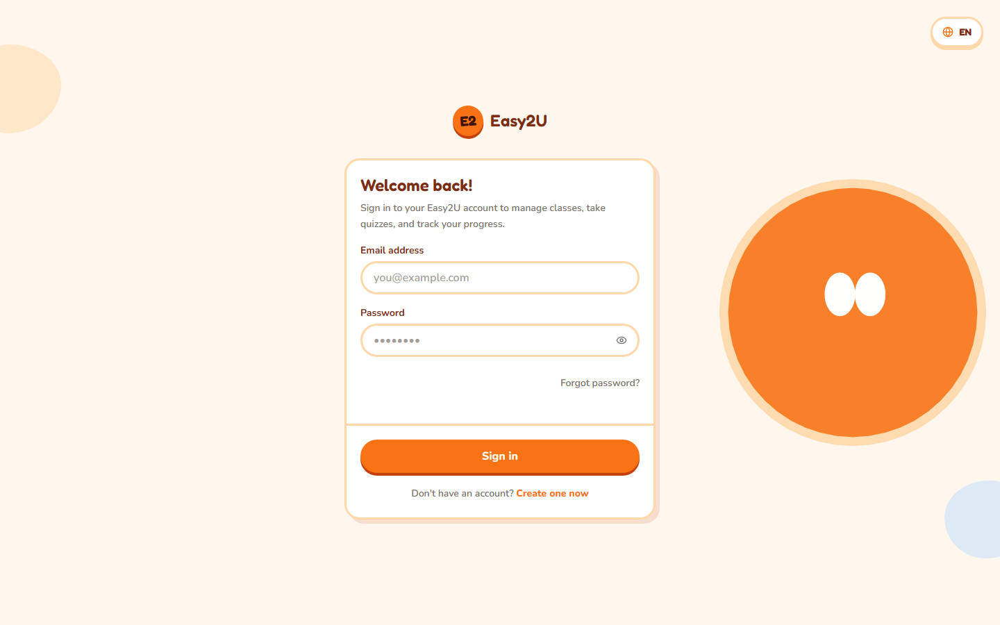</a><figcaption>Use the links below the sign-in form to create an account or recover a password. Select the image to enlarge it.</figcaption></figure>

## Find your way around

**Desktop — different navigation.** Use the top navigation: **My Classes**, **Class Quizzes**, **My Quizzes**, and **Face Setup**. Open the account control to see account information and **Sign out**. The bell opens notifications; its badge shows how many are unread. Select a notification to open its related page and mark it read, or select **Mark all as read**. The language control switches between **EN** and **BM**. The theme control cycles through **Light**, **Dark**, and **System**.

**Phone — different navigation.** Use the bottom navigation to open **My Classes**, **Class Quizzes**, **My Quizzes**, or **Face Setup**. The header keeps the brand, notification bell, and account avatar; select the avatar for the account sheet. Language and theme controls are in that sheet and work the same way as on desktop. The notification badge shows unread items; opening a notification marks it read.

<figure class="manual-shot" data-device="phone"><a href="screenshots/figures/s05-classes-phone.png">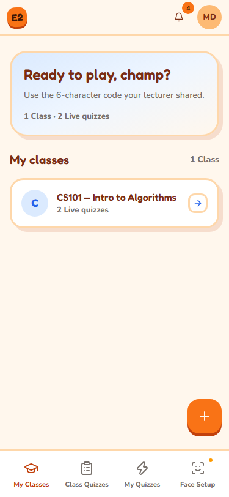</a><figcaption>On phones, the bottom navigation gives you the four student areas. Select the image to enlarge it.</figcaption></figure>

**What happens next:** **My Classes** is the place to join a class; **Class Quizzes** lists available class quizzes; **My Quizzes** is for personal practice quizzes.

## Join a class

**Where to go:** Sign in, then open **My Classes**. Get the six-character join code or class QR from your lecturer. You must be signed in as a student.

<figure class="manual-shot" data-device="desktop"><a href="screenshots/figures/s01-classes-desktop.png">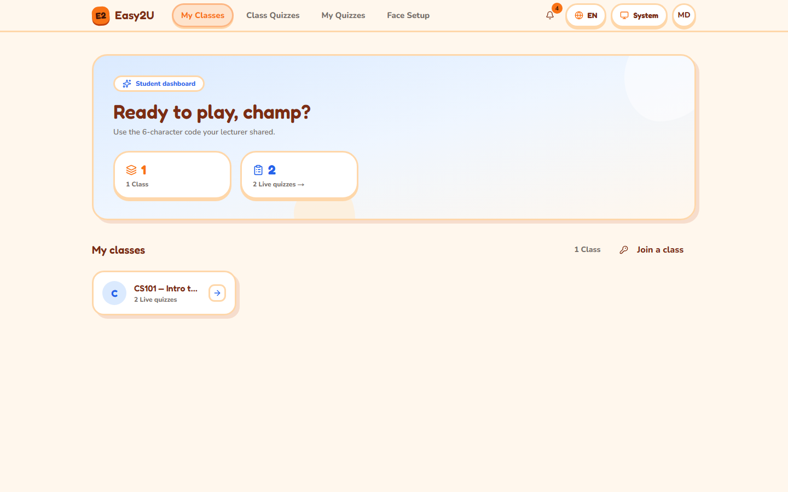</a><figcaption><strong>Desktop:</strong> select a class card to open its quizzes, or use Join a class to enter a code. Select the image to enlarge it.</figcaption></figure>

### Join with a code

1. **Desktop:** Select **Join a class** on the classes page. **Phone:** Select the floating **Join a class** control on **My Classes**; it opens a bottom drawer. If you have not joined any class yet, select **Enter a join code**.
2. Enter the six-character code in **Join code**. The entry accepts uppercase letters and numbers; codes exclude ambiguous characters.
3. Select **Join class**.

<figure class="manual-shot" data-device="desktop"><a href="screenshots/figures/s07-join-dialog-desktop.png">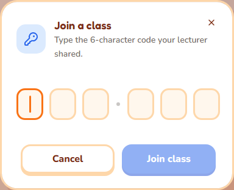</a><figcaption><strong>Desktop:</strong> enter the six characters in the join dialog, then select Join class. Select the image to enlarge it.</figcaption></figure>

<figure class="manual-shot" data-device="phone"><a href="screenshots/figures/s09-join-drawer-phone.png">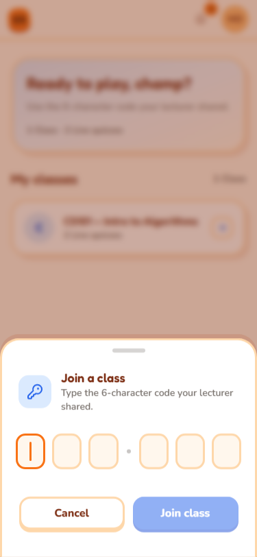</a><figcaption><strong>Phone:</strong> the same code entry opens in a bottom drawer. Select the image to enlarge it.</figcaption></figure>

**What happens next:** A success notice names the class, and the class appears under **My Classes**. Selecting its class card opens the class-filtered quiz list.

### Join from a QR code

1. Scan the QR code your lecturer provides with your phone camera. The code opens the class confirmation page.
2. If asked, sign in or create a student account. The app returns to the pending join confirmation.
3. Check the class join code shown on screen, then select **Join class**.

**What happens next:** The app confirms the join and returns to **My Classes**. Scanning alone does not join you; confirm the action on the page.

**If it does not work:** Check all six characters with your lecturer. A code may be invalid or for an archived class; repeated incorrect attempts may temporarily lock joining. If you already joined, the app reports that state. See [Troubleshooting](troubleshooting.md#class-joining).

## Find a class quiz

**Where to go:** Open **Class Quizzes**. To focus on one class, select its card from **My Classes**; the quiz list is then filtered to that class. A quiz must be live and within its availability window.

<figure class="manual-shot" data-device="desktop"><a href="screenshots/figures/s02-class-quizzes-desktop.png">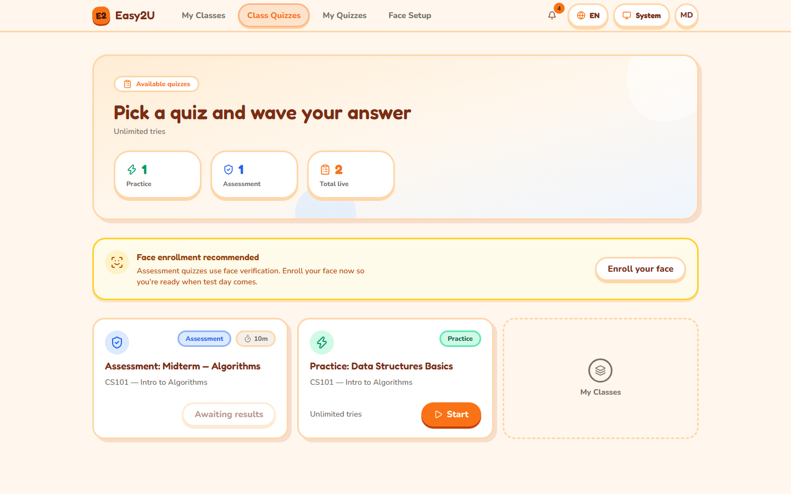</a><figcaption>Class quiz cards identify the mode and show the available action or current status. Select the image to enlarge it.</figcaption></figure>

1. Find the quiz by its title. Read its mode, due/deadline information if shown, time limit, and attempt status before starting.
2. Treat **Practice** as practice feedback and **Assessment** as graded class work. Correct answers may be hidden for an assessment until the lecturer releases results.
3. If the quiz is scheduled, wait until its opening time. If it is closed or the deadline has passed, contact the lecturer about availability.
4. Select **Start** to begin, or use the available resume/retake action shown on the quiz card. Retakes appear only when the lecturer has allowed them and attempts remain.

**Phone:** The same quiz states and actions appear in the compact list. Select the **Remove class filter** control when a class filter is active to return to all class quizzes.

<figure class="manual-shot" data-device="phone"><a href="screenshots/figures/s06-class-quizzes-phone.png">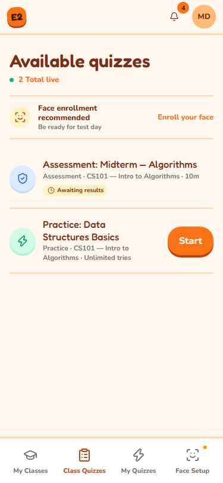</a><figcaption><strong>Phone:</strong> use the bottom navigation to return to Class Quizzes, then select the action on the quiz card. Select the image to enlarge it.</figcaption></figure>

**What happens next:** The quiz player opens. For an assessment, follow [Set up face verification](#set-up-face-verification) if required and then [Take and submit an assessment](#take-and-submit-an-assessment).

**If it does not work:** “Not open” means the scheduled window has not begun; “window closed” means it has ended. If the card says **Awaiting results**, the lecturer has not released your result yet. See [Troubleshooting](troubleshooting.md#class-quizzes-and-results).

## Set up face verification

**Where to go:** Open **Face Setup** from the top or bottom navigation, or select **Enroll your face** on the class quiz page. Some assessments require face verification; your lecturer or institution may configure different checks.

<figure class="manual-shot" data-device="desktop"><a href="screenshots/figures/s04-face-consent-desktop.png">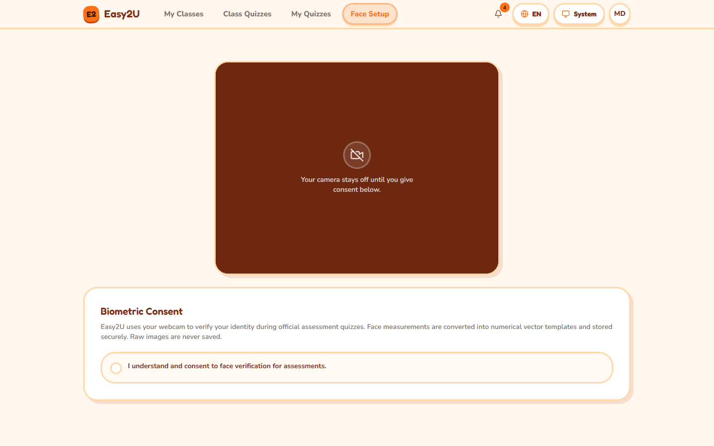</a><figcaption>Read the consent information before deciding whether to grant face verification consent. The camera stays off until you consent. Select the image to enlarge it.</figcaption></figure>

1. Read **Biometric Consent**. Select **I understand and consent to face verification for assessments** only if you agree to the described camera and face processing. The camera remains off until you grant consent.
2. Allow camera access when your browser asks. Use a working front-facing camera in a well-lit place. Close other apps or tabs using the camera.
3. Center one face in the guide. Follow the on-screen instruction to blink and turn your head to the front, left, and right positions. Wait for each angle to complete before moving to the next.
4. Wait for the result. The status may say enrollment succeeded or that it is pending review. Pending review is a normal review state, not an accusation; wait for the review to complete before starting an assessment that requires enrollment.
5. If already enrolled, the page shows that status and offers **Re-capture**. Use it if your appearance or enrollment needs updating. **Revoke Biometric Consent** withdraws consent and can make face-required assessments unavailable until setup is completed again.

**Phone:** The page uses the phone camera and shows the pose/lighting status below the video. Keep the browser page in the foreground while capturing.

**What happens next:** Return to **Class Quizzes** and start the assessment. If review is pending, wait and check again.

**If it does not work:** For denied permission, change the browser's camera permission for Easy2U, return to the page, and select **Retry**. If there is no camera, another app is using it, the page is not secure, the room is dim, no face is detected, or multiple faces are visible, address that condition and select **Try again**. Do not try to bypass verification. If capture repeatedly fails or enrollment remains pending, contact your lecturer. See [Troubleshooting](troubleshooting.md#face-setup-and-camera).

## Take and submit an assessment

**Where to go:** Open **Class Quizzes**, choose a live **Assessment**, and select **Start**. Read the instructions before beginning. A camera/liveness check or fullscreen prompt may appear depending on the quiz and institution settings.

<figure class="manual-shot" data-device="desktop"><a href="screenshots/figures/s08-practice-player-desktop.png">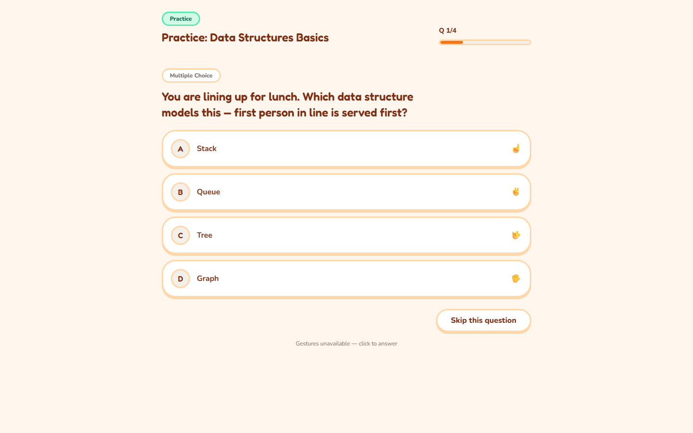</a><figcaption><strong>Desktop answer controls:</strong> this practice example shows the question, answer cards, progress, and Skip this question. An assessment may add a face gate and timer. Select the image to enlarge it.</figcaption></figure>

<figure class="manual-shot" data-device="phone"><a href="screenshots/figures/s10-practice-player-phone.png">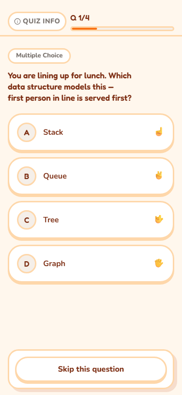</a><figcaption><strong>Phone answer controls:</strong> answer cards stack vertically, and Quiz Info appears above progress. This is a practice example; an assessment may add checks. Select the image to enlarge it.</figcaption></figure>

1. At the assessment gate, allow camera access if asked. Center your face and follow the blink instruction. If the app asks for fullscreen, accept the browser prompt. Select **Begin assessment** when it becomes available.
2. Read the question and its answer format. For a single-choice or true/false question, select one answer. For a multiple-select question, select every response you intend to submit, then select **Confirm answer** (or use the hand confirmation if it is enabled). For a short-text question, enter your response and select **Submit answer**.
3. Select **Next** after answering to continue. To leave a question unanswered, select **Skip this question**, then select **Next** (or **Finish** on the last question). A skipped question is recorded as unanswered and counts as zero; you cannot change it after advancing.
4. If hand gestures are enabled, hold the indicated hand pose steady and use the on-screen confirmation to choose or confirm an answer. If gestures are disabled, use the displayed answer and confirmation controls.
5. Watch the timer if one is shown. When finished, select **Finish**. A timer may submit automatically when it expires. Do not close the tab before the completion screen appears.

**Phone:** Keep the quiz page visible. Browser camera/fullscreen prompts can cover the page; answer those prompts to continue. Use the on-screen controls by touch. The assessment gate may ask you to select **Begin assessment** after the face check; quiz controls use the same labels as desktop.

**What happens next:** The player displays an assessment completion/submission state. Results may remain hidden until the lecturer reveals them. If the connection drops or the page reloads, return to **Class Quizzes** and use the card's resume action if one is available; do not assume unsent answers were saved.

**If it does not work:** Follow [Recover during a quiz](#recover-during-a-quiz) and the [During the quiz quick card](during-quiz.md). See also [Troubleshooting](troubleshooting.md#class-quizzes-and-results).

## Recover during a quiz

**Where to go:** Stay on the quiz page and read the pause or warning overlay. A temporary pause is a protection/recovery state and does not by itself mean your attempt was flagged.

1. Follow the message on the overlay. If it asks you to verify your face, center your face and blink when prompted.
2. If the camera stopped, restore the browser's camera permission, close any other app using the camera, and use the displayed retry/recovery action.
3. If the page lost focus or fullscreen, return to the quiz tab and re-enter fullscreen if prompted.
4. If the overlay says to wait for your lecturer to unlock the attempt, contact the lecturer and give them the quiz title and approximate time of the pause. Do not start a second attempt unless the quiz card explicitly offers a retake.
5. When the player resumes, check the question and timer. The app may save answers as you go, but do not assume an answer was saved if the connection failed before the player acknowledged it.

**Phone:** Keep the quiz page in the foreground; close notifications or other apps that take over the screen. Re-allow camera access in the browser if needed.

**What happens next:** A successful recovery returns you to the quiz or assessment gate. For a timed assessment, the countdown pauses during the recovery pause and resumes afterward.

**If it does not work:** Do not repeatedly reload or attempt to bypass the gate. Note the message and time, then ask your lecturer to inspect or unlock the attempt. See [Troubleshooting](troubleshooting.md#paused-or-interrupted-assessment).

For a compact recovery reference, open the [During the quiz card](during-quiz.md).

## See your results

**Where to go:** Open **Class Quizzes** and find the completed quiz.

1. If the card says **Awaiting results**, the lecturer has not revealed the result. You cannot open a score yet; check later or contact the lecturer if the release date has passed.
2. After release, select **View results** on the quiz card. The player results screen shows your score and, when enabled, question review/feedback.
3. For practice quizzes, feedback may appear immediately after completion. Use the review displayed by the player.

**Phone:** Use **Class Quizzes** in the bottom navigation. The same **Awaiting results** and **View results** states are available in the compact list.

**What happens next:** The result remains available from the quiz card while the quiz and account remain available.

**If it does not work:** If the result is still awaiting release, ask your lecturer when it will be available. If the quiz is missing, check that you joined the correct class and remove any active class filter. See [Troubleshooting](troubleshooting.md#class-quizzes-and-results).

## Make a personal practice quiz

**Where to go:** Open **My Quizzes**. Personal quizzes belong to your account and are for practice; they do not count as class assessment results.

<figure class="manual-shot" data-device="desktop"><a href="screenshots/figures/s03-my-quizzes-desktop.png">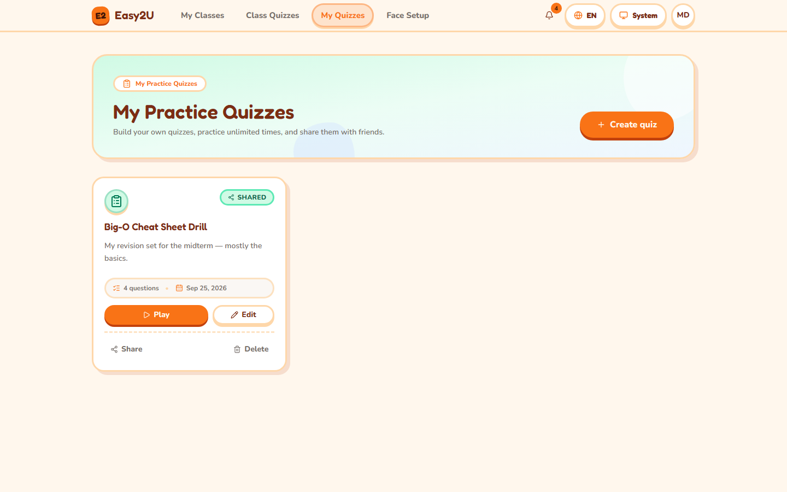</a><figcaption>Your personal practice quizzes appear under My Practice Quizzes. Select the image to enlarge it.</figcaption></figure>

1. Select **Create quiz**, enter a **Title**, then select **Create quiz** again to make the quiz.
2. In the editor, enter the question prompt and answer choices or response details for the question type shown. Choose the correct answer when that option is provided.
3. Select **Add this question**. Repeat for more questions. Use the editor's controls to edit, reorder, or delete questions; attach an image only if the image control is available.
4. If AI question generation is offered, review every generated question and answer before using it. Availability depends on institution configuration.
5. Return to the quiz list and select **Start** or the preview/play action to practice.

**Phone:** Open **My Quizzes** from the bottom navigation. The editor uses compact controls and opens question entry in a sheet. Follow the visible save/add controls.

**What happens next:** Your quiz appears in **My Quizzes** and can be played as personal practice.

**If it does not work:** Check required title, prompt, and answer fields. If an image or AI option is absent, it may not be enabled for your account. See [Troubleshooting](troubleshooting.md#personal-quizzes-and-sharing).

## Share or stop sharing a personal quiz

**Where to go:** Open **My Quizzes** and choose **Share** on the quiz you own.

1. Copy the displayed share link and send it to the intended recipient yourself. Anyone with an active share code may be able to open the practice content; share it accordingly.
2. To invalidate the current link, select **New code**, then **Confirm**. Give recipients the new link. The old link becomes unavailable.
3. To stop sharing, select **Stop sharing**. The old link becomes unavailable. A recipient already playing may lose access to questions/feedback as the quiz is unshared.
4. A recipient opens the shared link. If prompted, they sign in or create an account, then reopen the link and select **Start practice**.

**Phone:** Open **My Quizzes** in the bottom navigation and use the quiz's **Share** action. The share dialog is responsive; follow the displayed controls.

**What happens next:** A valid link opens the community-made practice quiz. A revoked, rotated, invalid, or unavailable code shows an unavailable message.

**If it does not work:** Confirm you copied the full current link and that the owner has not rotated the code or stopped sharing. Ask the owner for a fresh link. See [Troubleshooting](troubleshooting.md#personal-quizzes-and-sharing).
